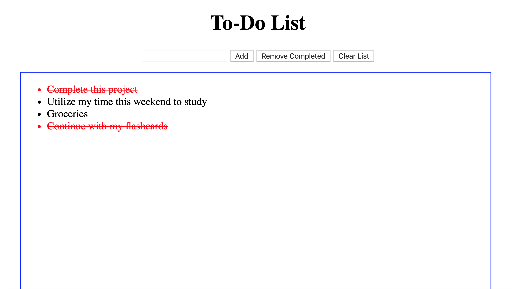

# ToDo List Express
This application gives users the ability to make a list of items to complete. They may add, remove, check as complete and completely clear the list.

## How It's Made:

**Tech used:** ejs, CSS, JavaScript, NodeJS and stored on MongoDB

This was a bit confusing to say the least. The idea I implemented was not quite the right one to use. I wrote most of my code on the client side instead of the server side because with the get refreshing my page and the put updating the actual list it would suffice. I mixed up the client and the server side.

## Lessons Learned:

What the client can interact with and see is client side code. The actual functionality of the program is completely server size.

## Installation

1. Clone repo
2. run `npm install`

## Usage

1. run `node server.js`
2. Navigate to `localhost:3000`
